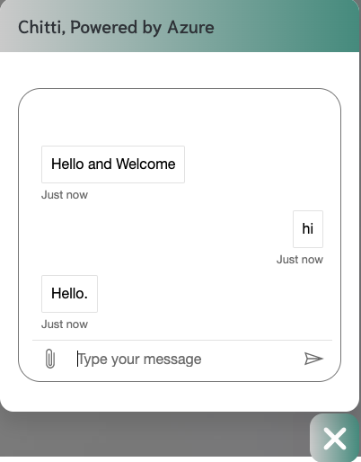
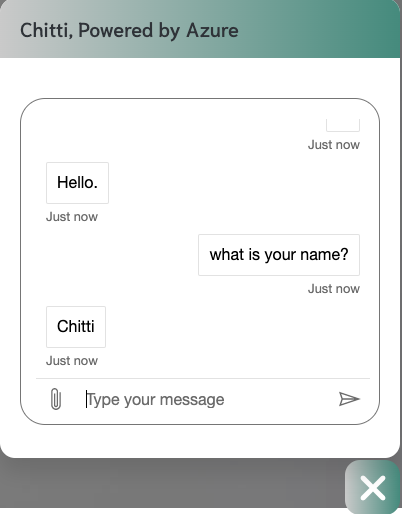
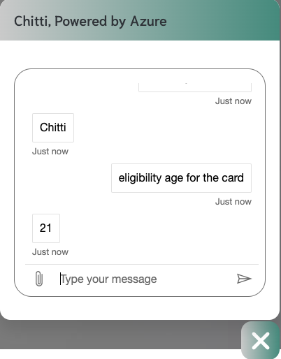
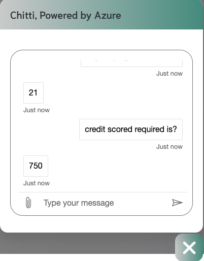

Certainly! Here's the revised README without images:

---

# FRT-Project

This repository hosts the final project of my Future Ready Talent Internship. The project was created and hosted using Microsoft Azure services, including Azure QnA Maker, Azure Web Bot, and Azure Static Web App. The project is a comprehensive banking website featuring a Chat Bot.

### About BankCard

BankCard is a website designed to help retail investors and credit card users invest in cryptocurrency or purchase products using cryptocurrency.

### Languages and Technologies Used

- HTML
- CSS
- JavaScript

### Core Azure Services Used

- [Static Web Apps](https://azure.microsoft.com/en-us/services/app-service/static/#overview)
- [QnA Maker](https://www.qnamaker.ai/)
- [Web App Bot](https://azure.microsoft.com/en-us/services/bot-services/#get-started)

[Link to Static Webpage](https://delightful-rock-0fd8dd910.1.azurestaticapps.net/)

### Project Overview

This was my first ever project built during my internship at Microsoft Azure. Through this project, I learned the basics of HTML and CSS. I also integrated Azure Bot Services to incorporate a chatbot into the website, providing users with an interactive experience.

### Features

- **Interactive Chat Bot**: The chatbot, named Chitti, is integrated using Azure Bot Services. It helps users navigate the website and get their queries answered in real-time.
- **Responsive Design**: The website is designed to be responsive, ensuring it works well on both desktop and mobile devices.
- **Informative Content**: The site includes sections for services, blog posts, contact information, and more.

### Page Descriptions

- **Home (index.html)**: The main landing page of the website, featuring an overview of services and navigation to other sections.
- **About (about.html)**: Provides information about the bank, its mission, and vision.
- **Services (services.html)**: Lists the various services provided, including mobile banking apps, personal profiles, cheque transfers, credit/debit cards, savings accounts, and 24/7 online support.
- **Blog (blog.html)**: Contains blog posts and news updates related to the bank.
- **Contact (contact.html)**: Includes a contact form and the bank's contact details, including address, phone numbers, email, and social media links.
- **Single (single.html)**: Template for individual blog posts or detailed service descriptions.

### Acknowledgements

I would like to thank Microsoft Azure for providing the platform and tools to build this project. The experience has been invaluable in learning web development and cloud services.

### Images of the Chat Bot [Chitti]

